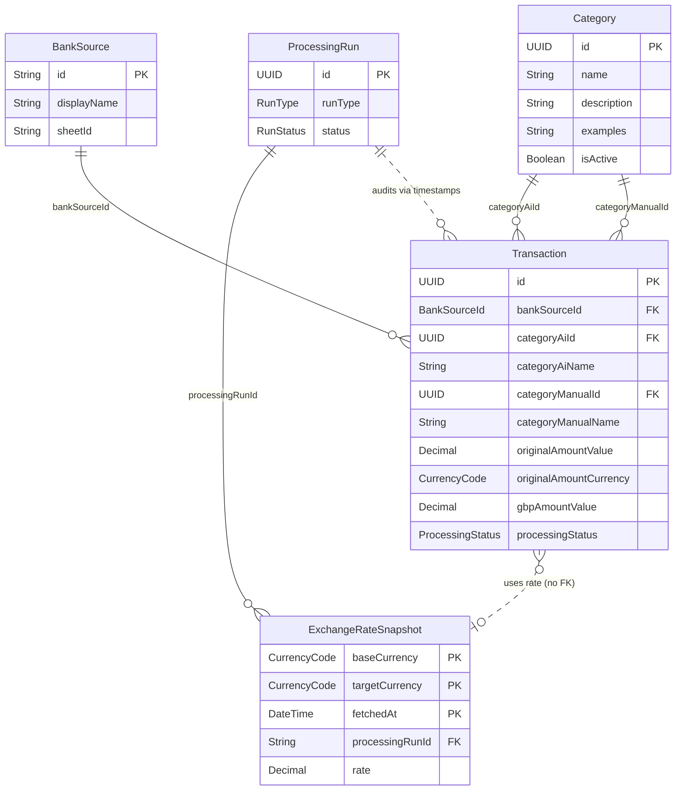

# Entity Models

This document defines the core domain entities for the FIRE transaction categorisation system. These entities represent the fundamental business concepts that persist throughout the system lifecycle.

## Overview

The FIRE system manages financial transactions from multiple bank sources, normalises them, and applies AI-driven categorisation. The entity model reflects this multi-phase processing architecture.

## Core Entities

### 1. Transaction

**Description**: Represents a single financial transaction from a bank source through its entire lifecycle (normalisation and categorisation).

**Identity**: Unique transaction identifier (UUID)

**Attributes** (alphabetically ordered, related fields grouped):

- `categoryAiId` (UUID, nullable) - Reference to Category entity (AI-assigned)
- `categoryAiName` (String, nullable) - Cached category name from AI (denormalized for performance)
- `categoryConfidenceScore` (Decimal, nullable) - AI categorisation confidence (0-100%)
- `categoryManualId` (UUID, nullable) - Reference to Category entity (user override)
- `categoryManualName` (String, nullable) - Cached category name from user (denormalized for performance)
- `country` (String, nullable) - Transaction country (if available)
- `description` (String) - Transaction description/merchant name
- `errorMessage` (String, nullable) - Error details if processing failed
- `exchangeRateValue` (Decimal, nullable) - Exchange rate used for conversion (null if originally in GBP)
- `gbpAmountValue` (Decimal) - Amount converted to GBP
- `id` (UUID) - Unique identifier for the transaction
- `notes` (String, nullable) - Additional notes or tags from source
- `originalAmountCurrency` (CurrencyCode) - Original currency (ISO 4217)
- `originalAmountValue` (Decimal) - Original transaction amount
- `originalTransactionId` (String) - Original transaction ID from the bank (may be auto-generated for banks without native IDs)
- `processingStatus` (ProcessingStatus) - Current processing state
- `bankSourceId` (BankSourceId) - Identifier of the source bank (Monzo, Revolut, or Yonder)
- `timestampCategorised` (DateTime, nullable) - Categorisation completion timestamp
- `timestampCreated` (DateTime) - System creation timestamp
- `timestampLastModified` (DateTime) - Last modification timestamp
- `timestampNormalised` (DateTime, nullable) - Normalisation completion timestamp
- `transactionDate` (DateTime) - Date and time of the transaction (ISO 8601 UTC format)
- `transactionType` (TransactionType) - Debit or Credit

**Enumerations**:

- `BankSourceId`: MONZO, REVOLUT, YONDER
- `CurrencyCode`: GBP, USD, EUR, CAD, AUD, JPY, MAD, THB, SGD, HKD, ZAR, NOK, CNY, SEK
- `ProcessingStatus`: UNPROCESSED, NORMALISED, CATEGORISED, ERROR
- `TransactionType`: DEBIT, CREDIT

**Lifecycle States**:

```text
UNPROCESSED → NORMALISED → CATEGORISED
            ↓
          ERROR (can occur at any stage)
```

**Business Rules**:

- Each transaction must have a unique ID
- Transactions cannot be deleted, only marked as ERROR
- Once categorised, transactions can be re-categorised but previous categorisation is not retained
- Manual category overrides always take precedence over AI categories
- Category IDs reference the Categories sheet; cached names are denormalized for performance
- When user edits categoryManualName, system resolves name to categoryManualId via onEdit trigger
- GBP amount is required; original amount and currency must be preserved
- Exchange rate is required for non-GBP transactions

**Relationships**:

- Belongs to one `BankSource`
- May reference one `Category` via `categoryAiId` (AI assignment)
- May reference one `Category` via `categoryManualId` (manual override)
- May have multiple similar transactions for historical learning (implicit relationship)

---

### 2. BankSource

**Description**: Represents a source bank/financial institution with its specific schema configuration.

**Identity**: Unique source identifier (String)

**Attributes**:

- `id` (String) - Unique identifier (e.g., "monzo", "revolut", "yonder")
- `displayName` (String) - Human-readable name
- `sheetId` (String) - Google Sheets ID for this source
- `hasNativeTransactionId` (Boolean) - Whether bank provides native transaction IDs
- `isActive` (Boolean) - Whether this source is currently being processed
- `columnMappings` (Map<String, String>) - Maps standard fields to source-specific column names
- `createdAt` (DateTime) - When source was configured
- `lastProcessedAt` (DateTime, nullable) - Last successful processing timestamp

**Column Mapping Schema**:

```text
Standard Field → Source Column Name
- date → "Date" | "Date/Time of transaction" | "Started Date"
- description → "Description" | "Name"
- amount → "Amount" | "Amount (GBP)"
- currency → "Currency"
- transactionId → "Transaction ID" | "ID"
- type → "Type" | "Debit or Credit"
- category → "Category" (source-provided, not used for AI categorisation)
- notes → "Notes and #tags" (optional)
- country → "Country" (optional)
```

**Business Rules**:

- Each source must have a unique identifier
- Column mappings must include all required fields: date, description, amount, currency
- Sources without native transaction IDs require ID backfilling
- Column mappings are immutable once transactions are processed

**Relationships**:

- Has many `Transaction` entities
- Configuration relates to specific Google Sheets

**Supported Sources**:

1. **Monzo**: Native transaction IDs, comprehensive metadata
2. **Revolut**: No native IDs (requires backfilling), separate started/completed dates
3. **Yonder**: No native IDs (requires backfilling), GBP-only transactions

---

### 3. Category

**Description**: Represents a transaction category used for classification.

**Identity**: Unique category ID (UUID)

**Attributes**:

- `id` (UUID) - Unique identifier, independent of row position
- `name` (String) - Unique category name (e.g., "Groceries", "Transport", "Entertainment")
- `description` (String) - Detailed description of what transactions belong in this category
- `examples` (String) - Example merchants/descriptions for this category
- `isActive` (Boolean) - Whether category is currently available for assignment
- `createdAt` (DateTime) - When category was defined
- `modifiedAt` (DateTime) - Last modification timestamp

**Business Rules**:

- Category IDs are UUIDs, stable regardless of row position
- Category names must be unique among active categories
- Categories can be reordered without breaking references
- Categories cannot be deleted if transactions reference them (soft delete via isActive preferred)
- AI can only assign categories from the active category list
- When user types category name, system resolves to category UUID via onEdit trigger
- Inactive categories remain in sheet for historical reference but cannot be assigned to new transactions

**Relationships**:

- Referenced by many `Transaction` entities (via categoryAiId or categoryManualId)

**Example Categories**:

- Groceries
- Transport
- Entertainment
- Bills & Utilities
- Dining Out
- Shopping
- Healthcare
- Travel
- Income
- Transfers
- Savings

---

### 4. ExchangeRateSnapshot

**Description**: Represents a snapshot of exchange rates fetched during a processing run.

**Identity**: Composite key (baseCurrency, targetCurrency, fetchedAt)

**Attributes**:

- `baseCurrency` (CurrencyCode) - Base currency (always GBP for this system)
- `targetCurrency` (CurrencyCode) - Target currency being converted from
- `rate` (Decimal) - Exchange rate (1 targetCurrency = rate GBP)
- `fetchedAt` (DateTime) - When this rate was fetched
- `provider` (String) - Exchange rate provider name
- `processingRunId` (String) - Identifier for the processing run that fetched this rate

**Business Rules**:

- Rates are fetched once per processing run for all required currencies
- Rates are immutable once fetched
- Multiple transactions in the same run use the same rate snapshot
- Historical rates are preserved for audit trail

**Relationships**:

- Used by many `Transaction` entities for conversion
- Associated with a specific processing run

---

### 5. ProcessingRun

**Description**: Represents a single execution of the normalization or categorisation process.

**Identity**: Unique run identifier (UUID)

**Attributes**:

- `id` (UUID) - Unique run identifier
- `runType` (RunType) - NORMALISATION or CATEGORISATION
- `startedAt` (DateTime) - When processing started
- `completedAt` (DateTime, nullable) - When processing completed
- `status` (RunStatus) - Current run status
- `transactionsProcessed` (Integer) - Number of transactions processed
- `transactionsSucceeded` (Integer) - Number successfully processed
- `transactionsFailed` (Integer) - Number that failed
- `errorLog` (Array<String>) - Collection of error messages
- `exchangeRateSnapshot` (Array<ExchangeRateSnapshot>) - Rates used in this run (normalisation only)

**Enumerations**:

- `RunStatus`: IN_PROGRESS, COMPLETED, FAILED, PARTIAL_SUCCESS
- `RunType`: NORMALISATION, CATEGORISATION

**Business Rules**:

- Each run must complete before the next run of the same type
- Failed runs should be logged for developer review
- Partial success is acceptable (some transactions fail, others succeed)
- Exchange rates are only fetched during normalization runs

**Relationships**:

- Processes many `Transaction` entities
- May create multiple `ExchangeRateSnapshot` entities

---

## Entity Relationships Diagram



## Key Design Decisions

### 1. Single Transaction Entity

Rather than separate entities for source and normalised transactions, we use a single `Transaction` entity that evolves through its lifecycle. This simplifies deduplication and provides a clear audit trail.

### 2. Status-Based Processing

The `ProcessingStatus` enum enables the two-phase architecture (NFR-006), allowing normalisation and categorisation to run independently.

### 3. Category References with Denormalized Names

Categories use a hybrid approach with both IDs and cached names:

- **Category IDs** (`categoryAiId`, `categoryManualId`) provide referential integrity and enable category renaming
- **Cached names** (`categoryAiName`, `categoryManualName`) provide performance and human readability
- **Dual storage** (AI vs Manual) maintains auditability and allows for historical learning (FR-014)
- **onEdit trigger** resolves user-typed category names to IDs automatically

This design allows:
- Users to type category names naturally in Google Sheets
- Categories to be renamed without breaking historical data
- Fast sheet performance (no VLOOKUP formulas needed)
- Category names to be reused over time (via soft delete/recreate)

### 4. Exchange Rate Snapshots

Rather than storing a single "current" exchange rate, we snapshot rates per processing run. This provides:

- Audit trail for conversions
- Consistency within a processing batch
- Historical rate tracking

### 5. Immutable Transaction IDs

Once assigned, transaction IDs never change. This is critical for:

- Deduplication (FR-010)
- Concurrent processing (FR-002)
- Cross-system referential integrity

## Implementation Notes

### Google Sheets Mapping

Each entity corresponds to specific columns in Google Sheets:

**Transaction → Result Sheet Columns**:

- Row number → Implicit surrogate key
- Columns → Direct mapping to attributes
- Category columns:
  - `categoryAiId` - Integer reference to Categories sheet row
  - `categoryAiName` - Cached AI category name (written by script)
  - `categoryManualId` - Integer reference to Categories sheet row
  - `categoryManualName` - User-editable category name (resolved to ID by onEdit trigger)
  - `category` - Formula: `=IF(categoryManualName<>"", categoryManualName, categoryAiName)`

**BankSource → Configuration**:

- Stored in Google Apps Script properties
- Not persisted as rows in sheets

**Category → Categories Configuration Sheet**:

- Dedicated "Categories" sheet with columns: id (UUID), name, description, examples, isActive, createdAt, modifiedAt
- Each row represents one category with stable UUID (independent of row position)
- UUID serves as category ID for foreign key references
- Easy for users to view and modify without touching code
- Users can reorder rows safely without breaking references
- Users can delete rows, but soft delete (isActive=FALSE) is preferred for audit trail

**ExchangeRateSnapshot → Audit Log Sheet (optional)**:

- Could be logged to separate sheet for audit purposes
- Or stored only in memory during processing run

### Persistence Strategy

- **Primary Storage**: Google Sheets (rows = transactions)
- **Configuration**:
  - Bank sources and mappings: Script Properties
  - Categories: Dedicated "Categories" sheet
- **Audit Logs**: Execution logs + optional audit sheet
- **State Management**: Status column in result sheet

## Related Requirements

This entity model directly supports the following requirements:

- **FR-001**: Transaction entity supports normalisation
- **FR-002**: Unique IDs enable concurrent handling
- **FR-003/004**: Currency attributes support conversion
- **FR-005**: Status and category attributes support async categorisation
- **FR-006**: BankSource entity encapsulates schema support
- **FR-007**: ExchangeRateSnapshot handles API integration
- **FR-010**: Transaction ID enables deduplication
- **FR-012**: Transaction ID backfilling
- **FR-013**: Dual category storage for manual overrides
- **FR-014**: Transaction relationships support historical learning
- **FR-015**: Category entity manages definitions
- **NFR-006**: ProcessingStatus supports two-phase architecture
