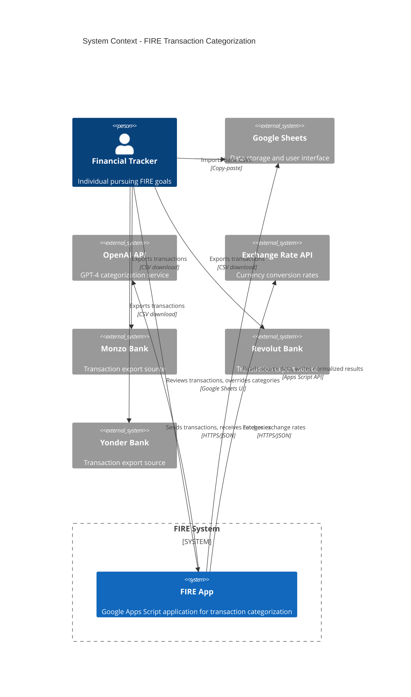
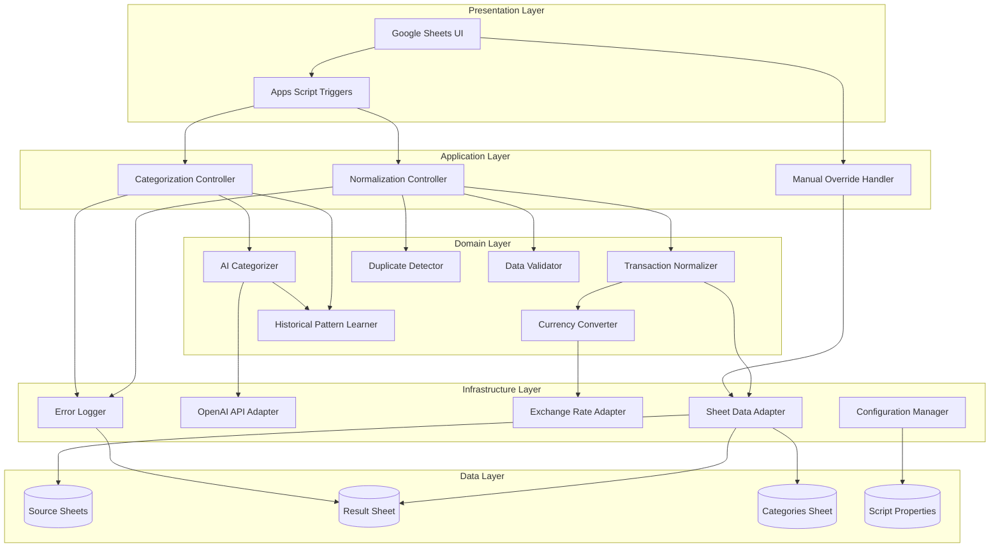
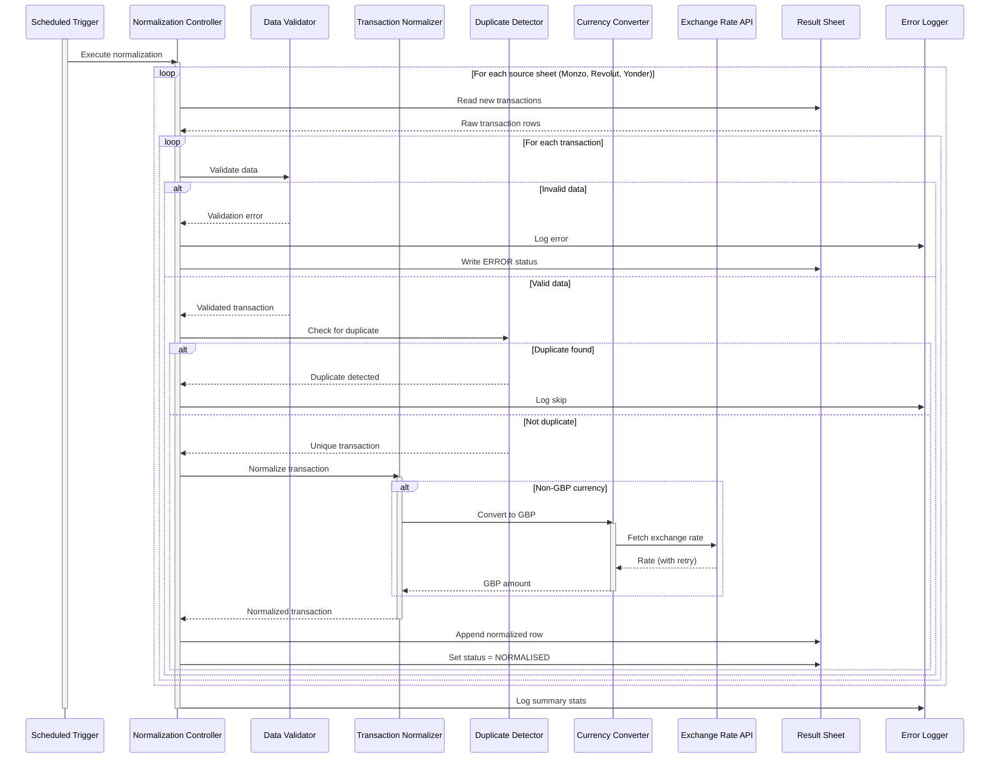
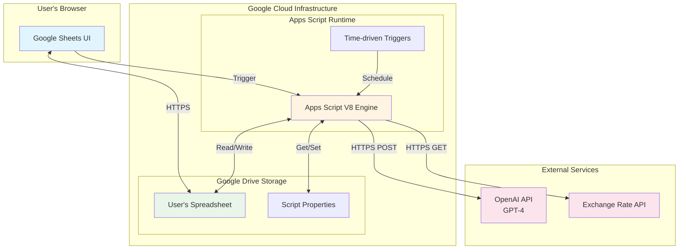
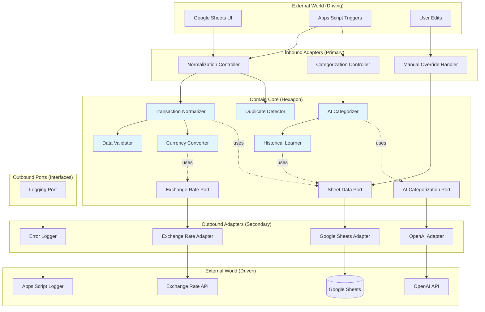
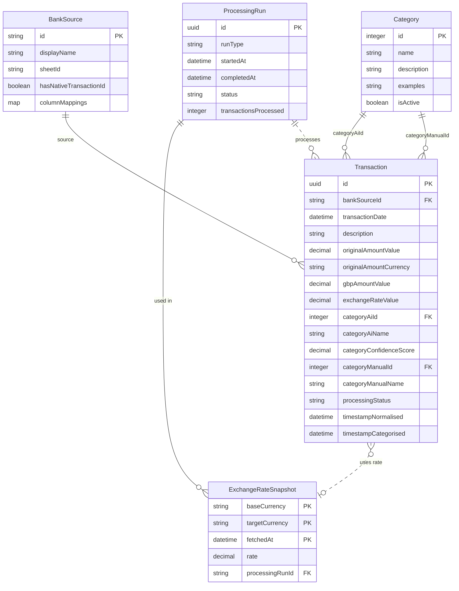

# Software Architecture Document (SAD)

## FIRE Transaction Categorization System

**Version**: 1.0
**Date**: 2025-11-18
**Phase**: Elaboration
**Status**: Draft

---

## Table of Contents

1. [Introduction](#1-introduction)
2. [Architectural Goals and Constraints](#2-architectural-goals-and-constraints)
3. [System Context](#3-system-context)
4. [Architectural Views](#4-architectural-views)
5. [Component Architecture](#5-component-architecture)
6. [Data Architecture](#6-data-architecture)
7. [Security Architecture](#7-security-architecture)
8. [Quality Attributes](#8-quality-attributes)
9. [Key Architectural Decisions](#9-key-architectural-decisions)
10. [Technology Stack](#10-technology-stack)
11. [Deployment Architecture](#11-deployment-architecture)
12. [Cross-Cutting Concerns](#12-cross-cutting-concerns)

---

## 1. Introduction

### 1.1 Purpose

This Software Architecture Document (SAD) describes the comprehensive architecture of the FIRE (Financial Independence, Retire Early) transaction categorization system. It serves as the authoritative guide for all architectural decisions, patterns, and constraints that shape the system.

### 1.2 Scope

The FIRE system is a Google Sheets-based application that:

- Normalizes financial transactions from multiple bank sources
- Converts multi-currency transactions to GBP
- Applies AI-powered categorization using GPT-4
- Enables user overrides and learning from historical patterns
- Operates entirely within the Google Sheets ecosystem

### 1.3 Intended Audience

- **Developers**: Understanding implementation requirements and constraints
- **Architects**: Evaluating design decisions and patterns
- **Project Stakeholders**: Understanding technical approach and limitations
- **Future Maintainers**: Comprehending system structure and rationale

### 1.4 Document Conventions

- **MUST/SHALL**: Mandatory architectural requirement
- **SHOULD**: Recommended architectural pattern
- **MAY**: Optional architectural consideration
- All diagrams use Mermaid notation
- Requirements are referenced by ID (e.g., FR-001, NFR-002)

### 1.5 Related Documents

- [Vision Statement](../01-inception/VISION.md)
- [Requirements Catalogue](../01-inception/requirements-catalogue.md)
- [Entity Models](entity-models.md)
- [Use Cases](use-cases.md)
- [Test Strategy](../01-inception/test-strategy.md)

---

## 2. Architectural Goals and Constraints

### 2.1 Business Goals

1. **Eliminate Manual Categorization**: Automate 95%+ of transaction categorization using AI
2. **Multi-Bank Consolidation**: Unified view of transactions across Monzo, Revolut, and Yonder
3. **Financial Independence Tracking**: Enable data-driven decisions toward FIRE goals
4. **Zero External Dependencies**: All data remains within user's Google account

### 2.2 Architectural Drivers

#### Quality Attribute Priorities (Ranked)

1. **Data Integrity** (Critical): No transaction data shall be lost or corrupted
2. **Reliability** (High): System operates consistently within Google Sheets limitations
3. **Auditability** (High): Full transparency of all categorization decisions
4. **Usability** (High): Non-technical users can review and override AI decisions
5. **Performance** (Medium): Process 100 transactions/day within acceptable timeframes
6. **Maintainability** (Medium): Easy to add new bank sources or categories

### 2.3 Technical Constraints

#### Platform Constraints

| Constraint | Impact | Mitigation |
|------------|--------|------------|
| **Google Apps Script 6-minute execution limit** | Long-running operations fail | Two-phase processing (normalize + categorize) |
| **No concurrent write support in Sheets** | Race conditions on simultaneous updates | Transaction ID-based deduplication, append-only writes |
| **Limited JavaScript environment** | No access to Node.js ecosystem | Pure JavaScript implementation, browser-compatible libraries only |
| **No native database** | Data stored as spreadsheet rows | Schema enforced via validation, indexes simulated via column ordering |
| **API rate limits (OpenAI)** | Cost and throttling concerns | Batch processing, caching, manual override support |

#### Regulatory & Business Constraints

- **Data Privacy**: All financial data MUST remain in user's Google account (no external storage)
- **API Costs**: OpenAI categorization costs MUST be minimized through batching
- **User Control**: Users MUST be able to override any AI decision
- **Backward Compatibility**: Schema changes MUST not break existing transaction data

### 2.4 Assumptions and Dependencies

#### Assumptions

- Users have Google Workspace account with Apps Script enabled
- Users have access to OpenAI API with GPT-4
- Bank export formats remain stable (Monzo, Revolut, Yonder)
- Transaction volume remains under 1000/month per user
- Users review results periodically (not real-time critical)

#### External Dependencies

| Dependency | Version | Purpose | Criticality | Fallback |
|------------|---------|---------|-------------|----------|
| Google Apps Script | Current | Execution runtime | Critical | None (platform locked) |
| Google Sheets API | v4 | Data persistence | Critical | None (platform locked) |
| OpenAI API | GPT-4 | AI categorization | High | Manual categorization |
| Exchange Rate API | v1 | Currency conversion | High | Manual GBP entry |

---

## 3. System Context

### 3.1 Context Diagram



### 3.2 External Interfaces

#### 3.2.1 User Interface

- **Medium**: Google Sheets browser interface
- **Interaction Pattern**: Asynchronous review and override
- **Frequency**: Daily to weekly reviews
- **Data Flow**: User imports CSVs → System processes → User reviews results

#### 3.2.2 OpenAI API

- **Protocol**: HTTPS REST API
- **Authentication**: Bearer token (API key from Script Properties)
- **Rate Limits**: 3 requests/minute (Tier 1), handled via batching
- **Payload**: JSON with transaction batch (max 10 transactions)
- **Response**: JSON with categories and confidence scores
- **Error Handling**: Exponential backoff, 5 retry attempts

#### 3.2.3 Exchange Rate API

- **Protocol**: HTTPS REST API
- **Authentication**: API key (optional, depends on provider)
- **Rate Limits**: Once per processing run
- **Currencies**: GBP, USD, EUR, CAD, AUD, JPY, MAD, THB, SGD, HKD, ZAR, NOK, CNY, SEK
- **Error Handling**: Retry 5 times, mark transactions as ERROR if all fail

#### 3.2.4 Google Sheets Storage

- **Access Pattern**: Read source sheets, append to result sheet
- **Concurrency**: No concurrent writes (append-only architecture)
- **Schema**: Column-based with validation rules
- **Triggers**: Time-driven (scheduled) and manual execution

---

## 4. Architectural Views

### 4.1 Logical View (Component Diagram)



### 4.2 Process View (Sequence Diagrams)

#### 4.2.1 Normalization Workflow



#### 4.2.2 Categorization Workflow

```mermaid
sequenceDiagram
    participant Trigger as Scheduled Trigger
    participant CC as Categorization Controller
    participant Sheet as Result Sheet
    participant HL as Historical Learner
    participant Cat as AI Categorizer
    participant OpenAI as OpenAI API
    participant Logger as Error Logger

    activate Trigger
    Trigger->>CC: Execute categorization
    activate CC

    CC->>Sheet: Query uncategorized transactions
    Sheet-->>CC: Transactions with status=NORMALISED

    loop Batch of 10 transactions
        CC->>HL: Find similar historical transactions
        activate HL
        HL->>Sheet: Search by merchant/amount patterns
        Sheet-->>HL: Similar transactions with categories
        HL-->>CC: Historical context
        deactivate HL

        CC->>Cat: Categorize batch with context
        activate Cat
        Cat->>OpenAI: POST /v1/chat/completions
        activate OpenAI

        alt API Success
            OpenAI-->>Cat: Categories + confidence scores
            deactivate OpenAI
            Cat-->>CC: Categorized transactions
            deactivate Cat

            loop For each transaction in batch
                CC->>Sheet: Update AI Category ID
                CC->>Sheet: Update AI Category Name
                CC->>Sheet: Update Confidence Score
                CC->>Sheet: Set status = CATEGORISED
                CC->>Sheet: Set timestamp categorised
            end

        else API Failure
            OpenAI-->>Cat: Error response
            deactivate OpenAI
            Cat-->>CC: Categorization failed
            deactivate Cat

            loop Retry up to 5 times with backoff
                Cat->>OpenAI: Retry request
                OpenAI-->>Cat: Response
            end

            alt All retries failed
                CC->>Logger: Log API error
                CC->>Sheet: Set status = ERROR
            end
        end
    end

    CC->>Logger: Log summary stats
    deactivate CC
    deactivate Trigger
```

#### 4.2.3 Manual Override Workflow

```mermaid
sequenceDiagram
    participant User
    participant SheetUI as Google Sheets UI
    participant Trigger as onEdit Trigger
    participant OH as Override Handler
    participant CatSheet as Categories Sheet
    participant ResultSheet as Result Sheet

    User->>SheetUI: Edit "Manual Category" cell
    activate SheetUI
    SheetUI->>Trigger: Fire onEdit event
    activate Trigger

    Trigger->>OH: Handle category override
    activate OH

    OH->>OH: Validate edit is in Manual Category column
    OH->>OH: Check source is USER (not SCRIPT)

    alt Valid user edit
        OH->>CatSheet: Search for category by name
        activate CatSheet

        alt Category found
            CatSheet-->>OH: Category UUID (ID)
            deactivate CatSheet
            OH->>ResultSheet: Update Manual Category ID
            OH->>ResultSheet: Update Manual Category Name (normalized)
            ResultSheet-->>OH: Success

        else Category not found
            CatSheet-->>OH: No match
            deactivate CatSheet
            OH->>ResultSheet: Clear Manual Category ID
            OH->>ResultSheet: Keep Manual Category Name (custom)
            OH->>Logger: Log custom category warning
        end

        Note over ResultSheet: Formula auto-updates:<br/>=IF(ManualCategory<>"", ManualCategory, AICategory)

    else Invalid edit (wrong column or script source)
        OH->>OH: Ignore event
    end

    deactivate OH
    deactivate Trigger
    SheetUI-->>User: Display updated category
    deactivate SheetUI
```

### 4.3 Physical View (Deployment Diagram)



### 4.4 Development View (Package Structure)

```
src/
├── controllers/              # Application orchestration
│   ├── NormalizationController.js
│   ├── CategorizationController.js
│   └── ManualOverrideController.js
│
├── domain/                   # Core business logic
│   ├── normalizers/
│   │   ├── TransactionNormalizer.js
│   │   ├── MonzoNormalizer.js
│   │   ├── RevolutNormalizer.js
│   │   └── YonderNormalizer.js
│   ├── categorization/
│   │   ├── AICategorizer.js
│   │   ├── HistoricalLearner.js
│   │   └── ConfidenceCalculator.js
│   ├── validation/
│   │   ├── DataValidator.js
│   │   ├── CurrencyValidator.js
│   │   └── DateValidator.js
│   └── processing/
│       ├── DuplicateDetector.js
│       ├── CurrencyConverter.js
│       └── StatusManager.js
│
├── infrastructure/           # External integrations
│   ├── adapters/
│   │   ├── GoogleSheetsAdapter.js
│   │   ├── OpenAIAdapter.js
│   │   └── ExchangeRateAdapter.js
│   ├── config/
│   │   ├── ConfigurationManager.js
│   │   └── BankSourceConfig.js
│   └── logging/
│       ├── ErrorLogger.js
│       └── AuditLogger.js
│
├── models/                   # Data entities
│   ├── Transaction.js
│   ├── Category.js
│   ├── BankSource.js
│   ├── ProcessingRun.js
│   └── ExchangeRateSnapshot.js
│
├── triggers/                 # Apps Script entry points
│   ├── scheduledNormalization.js
│   ├── scheduledCategorization.js
│   └── onEditTrigger.js
│
└── utils/                    # Shared utilities
    ├── RetryUtils.js
    ├── DateUtils.js
    └── StringUtils.js

test/
├── unit/
│   ├── normalizers/
│   ├── categorization/
│   └── validation/
├── integration/
│   ├── sheets/
│   └── api/
└── e2e/
    └── workflows/

docs/
└── aiup/
    ├── 01-inception/
    │   ├── VISION.md
    │   ├── requirements-catalogue.md
    │   └── test-strategy.md
    └── 02-elaboration/
        ├── entity-models.md
        ├── use-cases.md
        └── software-architecture-document.md (this file)
```

---

## 5. Component Architecture

### 5.1 Layered Architecture Pattern

The FIRE system follows a **strict layered architecture** with clear separation of concerns:

```
┌─────────────────────────────────────┐
│     Presentation Layer              │  ← Google Sheets UI, Triggers
├─────────────────────────────────────┤
│     Application Layer               │  ← Controllers, Orchestration
├─────────────────────────────────────┤
│     Domain Layer                    │  ← Business Logic (Normalizers, Categorizers)
├─────────────────────────────────────┤
│     Infrastructure Layer            │  ← Adapters (Sheets, OpenAI, Exchange API)
├─────────────────────────────────────┤
│     Data Layer                      │  ← Google Sheets Persistence
└─────────────────────────────────────┘
```

**Dependency Rule**: Each layer may only depend on layers below it. Domain layer MUST NOT depend on infrastructure.

### 5.2 Architectural Style: Hexagonal Architecture (Ports & Adapters)

The FIRE system follows **Hexagonal Architecture** (also known as the Ports and Adapters pattern), which ensures the domain logic remains independent of external dependencies. This architectural style complements the layered structure by explicitly defining how the domain core interacts with the outside world.

#### 5.2.1 Core Principles

**Architecture Philosophy**:
- **Domain at the center**: Business logic is technology-agnostic and has zero dependencies on infrastructure
- **Ports**: Interfaces defined by the domain's needs (what the domain requires)
- **Adapters**: Concrete implementations of ports for specific technologies (how those needs are fulfilled)
- **Dependency Inversion**: Infrastructure depends on domain interfaces, not vice versa

#### 5.2.2 Hexagonal Architecture Diagram



#### 5.2.3 Application in FIRE

**Domain Core** (Technology-Agnostic Business Logic):

The hexagon contains all business rules and domain logic:
- **Transaction Normalization**: Converting bank-specific formats to unified schema
- **Categorization Algorithms**: AI-driven and historical pattern matching
- **Validation Rules**: Data integrity constraints
- **Business Constraints**: Deduplication, currency conversion logic

The domain core has **zero knowledge** of:
- Google Sheets API
- OpenAI API specifics
- Exchange rate provider implementation
- Apps Script runtime environment

**Inbound Ports** (Driving the Application):

These are the entry points that drive the domain:

```javascript
// Application Layer - Orchestrates domain logic
class NormalizationController {
  constructor(sheetPort, logPort) {
    this.sheetDataPort = sheetPort;  // Injected dependency
    this.logPort = logPort;          // Injected dependency
  }

  executeNormalization() {
    // Orchestrates domain objects
    const normalizer = new TransactionNormalizer();
    const validator = new DataValidator();
    const duplicateDetector = new DuplicateDetector();

    // Uses ports to interact with infrastructure
    const rawTransactions = this.sheetDataPort.readSourceSheet('MONZO');
    // ... business logic ...
  }
}
```

**Outbound Ports** (Driven by the Application):

These are interfaces defined by domain needs:

```javascript
// Domain defines what it needs (interface/port)
class SheetDataPort {
  /**
   * Read transactions from a source sheet
   * @param {string} bankSourceId - Bank identifier
   * @returns {Array<Object>} Raw transaction data
   */
  readSourceSheet(bankSourceId) {
    throw new Error('Must be implemented by adapter');
  }

  /**
   * Write normalized transaction to result sheet
   * @param {Transaction} transaction - Normalized transaction entity
   */
  writeTransaction(transaction) {
    throw new Error('Must be implemented by adapter');
  }

  /**
   * Check if transaction already exists
   * @param {string} transactionId - Unique transaction ID
   * @returns {boolean} True if exists
   */
  transactionExists(transactionId) {
    throw new Error('Must be implemented by adapter');
  }
}

class AICategorizationPort {
  /**
   * Categorize a batch of transactions
   * @param {Array<Transaction>} transactions - Transactions to categorize
   * @param {Array<Category>} categories - Available categories
   * @param {Object} context - Historical context
   * @returns {Array<Object>} Categories with confidence scores
   */
  categorizeBatch(transactions, categories, context) {
    throw new Error('Must be implemented by adapter');
  }
}

class ExchangeRatePort {
  /**
   * Fetch current exchange rate
   * @param {string} fromCurrency - Source currency (ISO 4217)
   * @param {string} toCurrency - Target currency (always GBP)
   * @returns {number} Exchange rate
   */
  getExchangeRate(fromCurrency, toCurrency) {
    throw new Error('Must be implemented by adapter');
  }
}
```

**Outbound Adapters** (Concrete Implementations):

These implement the ports for specific technologies:

```javascript
// Infrastructure Layer - Implements domain-defined port
class GoogleSheetsAdapter extends SheetDataPort {
  constructor(spreadsheet) {
    super();
    this.spreadsheet = spreadsheet;
  }

  readSourceSheet(bankSourceId) {
    // Google Sheets-specific implementation
    const sheet = this.spreadsheet.getSheetByName(bankSourceId);
    const data = sheet.getDataRange().getValues();
    return this.parseRows(data);
  }

  writeTransaction(transaction) {
    // Google Sheets-specific implementation
    const resultSheet = this.spreadsheet.getSheetByName('Transactions');
    const row = this.transactionToRow(transaction);
    resultSheet.appendRow(row);
  }

  transactionExists(transactionId) {
    // Google Sheets-specific implementation
    const resultSheet = this.spreadsheet.getSheetByName('Transactions');
    const idColumn = resultSheet.getRange('A:A').getValues();
    return idColumn.flat().includes(transactionId);
  }
}

class OpenAIAdapter extends AICategorizationPort {
  constructor(apiKey, model) {
    super();
    this.apiKey = apiKey;
    this.model = model;
  }

  categorizeBatch(transactions, categories, context) {
    // OpenAI-specific implementation
    const prompt = this.buildPrompt(transactions, categories, context);
    const response = UrlFetchApp.fetch('https://api.openai.com/v1/chat/completions', {
      method: 'POST',
      headers: {
        'Authorization': `Bearer ${this.apiKey}`,
        'Content-Type': 'application/json'
      },
      payload: JSON.stringify({
        model: this.model,
        messages: [{ role: 'system', content: prompt }],
        temperature: 0.3
      })
    });
    return this.parseResponse(response);
  }
}

class ExchangeRateAdapter extends ExchangeRatePort {
  constructor(apiEndpoint, apiKey) {
    super();
    this.apiEndpoint = apiEndpoint;
    this.apiKey = apiKey;
  }

  getExchangeRate(fromCurrency, toCurrency) {
    // Exchange Rate API-specific implementation
    const url = `${this.apiEndpoint}?base=${toCurrency}&symbols=${fromCurrency}`;
    const response = UrlFetchApp.fetch(url);
    const data = JSON.parse(response.getContentText());
    return data.rates[fromCurrency];
  }
}
```

#### 5.2.4 Dependency Injection

The system uses **constructor injection** to wire adapters to controllers:

```javascript
// Main entry point - wiring dependencies
function initializeSystem() {
  const spreadsheet = SpreadsheetApp.getActiveSpreadsheet();
  const config = ConfigurationManager.getOpenAIConfig();

  // Create adapters (infrastructure)
  const sheetAdapter = new GoogleSheetsAdapter(spreadsheet);
  const aiAdapter = new OpenAIAdapter(config.apiKey, config.model);
  const exchangeAdapter = new ExchangeRateAdapter(
    ConfigurationManager.get('EXCHANGE_RATE_PROVIDER'),
    ConfigurationManager.get('EXCHANGE_RATE_API_KEY')
  );
  const logger = new ErrorLogger(sheetAdapter);

  // Inject adapters into controllers (inversion of control)
  const normController = new NormalizationController(
    sheetAdapter,
    exchangeAdapter,
    logger
  );

  const catController = new CategorizationController(
    sheetAdapter,
    aiAdapter,
    logger
  );

  return { normController, catController };
}

// Apps Script trigger
function scheduledNormalization() {
  const system = initializeSystem();
  system.normController.executeNormalization();
}
```

#### 5.2.5 Benefits for FIRE

**Testability**:
```javascript
// Domain logic can be tested without Google Sheets or OpenAI
class MockSheetAdapter extends SheetDataPort {
  constructor(mockData) {
    super();
    this.mockData = mockData;
    this.writtenTransactions = [];
  }

  readSourceSheet(bankSourceId) {
    return this.mockData[bankSourceId] || [];
  }

  writeTransaction(transaction) {
    this.writtenTransactions.push(transaction);
  }

  transactionExists(transactionId) {
    return this.writtenTransactions.some(t => t.id === transactionId);
  }
}

// Test without any external dependencies
test('normalization deduplicates transactions', () => {
  const mockAdapter = new MockSheetAdapter({
    'MONZO': [
      { id: 'tx_001', description: 'Tesco', amount: -23.45 },
      { id: 'tx_001', description: 'Tesco', amount: -23.45 } // duplicate
    ]
  });

  const controller = new NormalizationController(mockAdapter, null, null);
  controller.executeNormalization();

  expect(mockAdapter.writtenTransactions.length).toBe(1); // Only one transaction written
});
```

**Flexibility**:
- ✅ Swap OpenAI for Anthropic Claude by creating `ClaudeAdapter extends AICategorizationPort`
- ✅ Replace Google Sheets with PostgreSQL by creating `PostgresAdapter extends SheetDataPort`
- ✅ Change exchange rate provider by creating new `ExchangeRateAdapter` implementation
- ✅ Add new data sources (e.g., CSV files) without touching domain logic

**Business Logic Isolation**:
- ✅ Domain rules remain stable even when infrastructure changes
- ✅ Can test business logic without Apps Script runtime
- ✅ Can develop domain logic locally before deploying to Google Apps Script

**Regulatory Compliance**:
- ✅ Domain logic doesn't expose API keys or sensitive data
- ✅ Data validation happens in domain layer (technology-independent)
- ✅ Audit trail logic separated from logging infrastructure

#### 5.2.6 Secondary Patterns

**Strategy Pattern** (Bank Normalizers):

Used within the domain core to handle bank-specific normalization:

```javascript
// Domain Layer - Strategy pattern for bank-specific logic
class TransactionNormalizer {
  constructor(bankSource) {
    this.strategy = this.selectStrategy(bankSource);
  }

  selectStrategy(bankSource) {
    const strategies = {
      'MONZO': new MonzoNormalizer(),
      'REVOLUT': new RevolutNormalizer(),
      'YONDER': new YonderNormalizer()
    };
    return strategies[bankSource.id];
  }

  normalize(rawData) {
    return this.strategy.normalize(rawData);
  }
}
```

**Pipeline Pattern** (Processing Workflow):

Transactions flow through a sequence of independent, composable stages:

```
Raw Data → Validate → Normalize → Convert Currency → Detect Duplicates → Persist
                ↓          ↓              ↓                  ↓              ↓
             (Error)    (Error)        (Error)           (Skip)         (Success)
```

Each stage:
- Has single responsibility
- Is independently testable
- Can fail without affecting other stages
- Passes output to next stage

**Repository Pattern** (Data Access):

`GoogleSheetsAdapter` acts as a repository, abstracting data access:

```javascript
class GoogleSheetsAdapter extends SheetDataPort {
  // Repository-like methods
  findTransactionById(id) { /* ... */ }
  findTransactionsByMerchant(merchant) { /* ... */ }
  findTransactionsByDateRange(start, end) { /* ... */ }
  saveTransaction(transaction) { /* ... */ }
  saveTransactions(transactions) { /* ... */ }
}
```

#### 5.2.7 Comparison with Traditional Layered Architecture

**Traditional Layered** (what we started with):
```
Presentation → Application → Domain → Infrastructure → Data
     ↓              ↓            ↓            ↓
  (depends on layers below, but infrastructure depends on domain)
```

**Hexagonal** (what we actually built):
```
           ┌─────────────────┐
  Driving  │                 │  Driven
  Adapters │  Domain Core    │  Adapters
     →     │  (Hexagon)      │     ←
  (UI)     │                 │  (APIs, DBs)
           └─────────────────┘
```

**Key Difference**:
- Layered: Infrastructure is at the bottom (domain depends on it indirectly)
- Hexagonal: Domain is at the center (infrastructure depends on domain ports)

**Why Both?**:
- **Layered Architecture** organizes code **vertically** (presentation → data)
- **Hexagonal Architecture** organizes dependencies **radially** (outside → domain core)
- They complement each other: Use layers for structure, hexagon for dependencies

#### 5.2.8 Architectural Style Summary

| Aspect | Pattern/Style | Rationale |
|--------|---------------|-----------|
| **Primary Structure** | Hexagonal Architecture | Domain independence, testability |
| **Vertical Organization** | Layered Architecture | Clear separation of concerns |
| **Bank-Specific Logic** | Strategy Pattern | Extensibility for new banks |
| **Processing Flow** | Pipeline Pattern | Composable, fault-tolerant stages |
| **Data Access** | Repository Pattern | Abstract Sheets as persistence |
| **Dependency Management** | Dependency Injection | Loose coupling, testability |
| **Domain Modeling** | DDD-Lite | Rich entities, ubiquitous language |

**Architecture Metaphor**: Think of the system as a **hexagonal fortress**:
- The domain core (business logic) is the **keep** at the center—protected and unchanging
- Ports are **gates** through which the domain interacts with the outside world
- Adapters are **bridges** connecting those gates to specific external systems
- Controllers are **commanders** that orchestrate domain actions

### 5.3 Core Components

#### 5.2.1 Normalization Controller

**Responsibility**: Orchestrate the end-to-end normalization workflow (UC-001, UC-005)

**Key Operations**:

- `executeNormalization()`: Entry point for scheduled trigger
- `processSourceSheet(bankSourceId)`: Process single bank source
- `normalizeTransaction(rawData)`: Coordinate validation, conversion, deduplication

**Dependencies**:

- Data Validator (validation)
- Transaction Normalizer (transformation)
- Duplicate Detector (deduplication)
- Currency Converter (GBP conversion)
- Sheet Adapter (persistence)
- Error Logger (monitoring)

**Error Handling**:

- Catch all exceptions at controller level
- Log errors with full context
- Mark failed transactions with ERROR status
- Continue processing remaining transactions (partial success acceptable)

#### 5.2.2 Categorization Controller

**Responsibility**: Orchestrate AI-powered categorization workflow (UC-002, UC-006)

**Key Operations**:

- `executeCategorization()`: Entry point for scheduled trigger
- `categorizeBatch(transactions[])`: Process batch of 10 transactions
- `applyHistoricalLearning(transaction)`: Find and apply manual override patterns

**Dependencies**:

- AI Categorizer (GPT-4 integration)
- Historical Learner (pattern matching)
- Sheet Adapter (read/write)
- Error Logger (monitoring)

**Batch Processing Strategy**:

- Query for transactions with status = "NORMALISED"
- Process in batches of 10 (OpenAI API optimization)
- Commit each batch independently (partial success)
- Track processing run statistics

#### 5.2.3 Manual Override Handler

**Responsibility**: Process user category overrides via onEdit trigger (UC-003)

**Key Operations**:

- `handleCategoryOverride(editEvent)`: Entry point for onEdit trigger
- `resolveCategoryId(categoryName)`: Look up category ID by name
- `updateManualOverride(transactionRow, categoryId)`: Persist override

**Trigger Guard Conditions**:

- Edit MUST be in "Manual Category" column
- Edit source MUST be USER (not SCRIPT to prevent infinite loops)
- Category name MUST be non-empty string

**ID Resolution Logic**:

1. Search Categories sheet for exact name match (case-insensitive)
2. Filter by `isActive = TRUE`
3. If found: update both Manual Category ID and Name
4. If not found: keep name only, log custom category warning

#### 5.2.4 Transaction Normalizer

**Responsibility**: Transform bank-specific formats to unified schema (FR-001, FR-006)

**Design Pattern**: Strategy Pattern (one normalizer per bank source)

```javascript
class TransactionNormalizer {
  constructor(bankSource) {
    this.strategy = this.selectStrategy(bankSource);
  }

  normalize(rawData) {
    return this.strategy.normalize(rawData);
  }
}

class MonzoNormalizer extends BankNormalizer {
  normalize(rawData) {
    // Monzo-specific mapping
    return {
      id: rawData['Transaction ID'],
      date: this.parseDate(rawData['Date'], rawData['Time']),
      description: rawData['Name'],
      amount: parseFloat(rawData['Amount']),
      currency: rawData['Currency'],
      // ...
    };
  }
}
```

**Bank-Specific Strategies**:

- `MonzoNormalizer`: Native transaction IDs, comprehensive metadata
- `RevolutNormalizer`: Generate IDs, handle Started vs Completed dates
- `YonderNormalizer`: Generate IDs, GBP-only transactions

**Extensibility**: Adding new bank requires only new strategy class

#### 5.2.5 AI Categorizer

**Responsibility**: Integrate with OpenAI GPT-4 for transaction categorization (FR-005)

**Key Operations**:

- `categorize(transactions[], historicalContext)`: Send batch to GPT-4
- `buildPrompt(transactions[], categories[], context)`: Construct AI prompt
- `parseResponse(apiResponse)`: Extract categories and confidence scores

**Prompt Engineering**:

```
System: You are a financial transaction categorizer.
Categories available: [list with descriptions]

Context: Similar historical transactions:
- "Tesco Metro" → Groceries (manual override)
- "Sainsbury's" → Groceries (confidence: 95%)

Task: Categorize these transactions and provide confidence (0-100):
1. Date: 2025-11-15, Merchant: Tesco Express, Amount: -£23.45
2. ...

Response format: JSON array
[
  { "index": 1, "category": "Groceries", "confidence": 92 },
  ...
]
```

**Configuration**:

- Model: `gpt-4` (configurable in Script Properties)
- Temperature: `0.3` (low for consistent categorization)
- Max tokens: `500` (sufficient for batch responses)

#### 5.2.6 Historical Pattern Learner

**Responsibility**: Find similar transactions to improve categorization accuracy (FR-014)

**Similarity Matching Algorithm**:

1. **Exact merchant match**: Same description → highest priority
2. **Fuzzy merchant match**: Levenshtein distance < 3 → high priority
3. **Amount range match**: Within ±10% → medium priority
4. **Merchant + amount**: Combined match → highest confidence

**Manual Override Prioritization**:

- If similar transaction has manual override → suggest that category
- If multiple overrides conflict → use most recent
- Manual overrides weighted 2x higher than AI suggestions

**Performance Optimization**:

- Search only last 90 days of transactions
- Index by merchant name (simulated via sorting)
- Limit to 5 similar transactions per lookup

#### 5.2.7 Duplicate Detector

**Responsibility**: Prevent duplicate transactions in result sheet (FR-010)

**Deduplication Strategy**:

- **Primary Key**: `originalTransactionId` (from bank or generated)
- **Algorithm**: Hash-based lookup in existing transactions
- **Conflict Resolution**: Skip duplicate, log warning

**ID Generation for Banks Without Native IDs** (FR-012):

```javascript
function generateTransactionId(bankSource, rawData) {
  const components = [
    bankSource.id,
    rawData.date,
    rawData.description,
    rawData.amount,
    rawData.currency
  ];
  return sha256(components.join('|'));
}
```

**Idempotency Guarantee**: Running normalization multiple times produces same IDs

#### 5.2.8 Currency Converter

**Responsibility**: Convert non-GBP amounts to GBP (FR-003, FR-004, FR-007)

**Key Operations**:

- `convertToGBP(amount, currency, date)`: Perform conversion
- `fetchExchangeRate(currency)`: Get rate from external API
- `cacheRateForRun(currency, rate)`: Store in-memory for run

**Optimization Strategy**:

- Fetch exchange rates **once per processing run**
- Cache all rates in memory (ProcessingRun entity)
- Reuse cached rates for all transactions in same run
- Only fetch currencies present in current batch

**Rate Provider**:

- Provider: ExchangeRate-API or similar
- Endpoint: `GET /latest?base=GBP&symbols=USD,EUR,...`
- Retry: 5 attempts with exponential backoff
- Fallback: Mark transactions as ERROR if all retries fail

---

## 6. Data Architecture

### 6.1 Entity Relationship Diagram

See [Entity Models](entity-models.md) for comprehensive entity definitions. Summary:



### 6.2 Google Sheets Schema

#### 6.2.1 Source Sheets (Monzo, Revolut, Yonder)

Each bank has its own sheet with bank-specific columns:

**Monzo Sheet**:

| Column | Type | Example |
|--------|------|---------|
| Transaction ID | String | `tx_00009ZRXgBVk4qr3bjxkP8` |
| Date | Date | `15/11/2025` |
| Time | Time | `14:23:45` |
| Name | String | `Tesco Metro` |
| Amount | Number | `-23.45` |
| Currency | String | `GBP` |
| Category | String | `groceries` (ignored by system) |
| Type | String | `Card payment` |
| Description | String | `Tesco Metro London` |
| Notes and #tags | String | `#groceries #weekly` |

**Revolut Sheet**:

| Column | Type | Example |
|--------|------|---------|
| ID | String | *(empty, backfilled by system)* |
| Started Date | Date | `2025-11-15 14:23` |
| Completed Date | Date | `2025-11-15 14:25` |
| Description | String | `Card payment to Tesco` |
| Amount | Number | `-23.45` |
| Fee | Number | `-0.15` |
| Currency | String | `EUR` |
| State | String | `COMPLETED` |
| Balance | Number | `1250.34` |
| Type | String | `CARD_PAYMENT` |
| Product | String | `Current` |

**Yonder Sheet**:

| Column | Type | Example |
|--------|------|---------|
| ID | String | *(empty, backfilled by system)* |
| Date/Time of transaction | DateTime | `15/11/2025 14:23` |
| Description | String | `TESCO STORES` |
| Amount (GBP) | Number | `-23.45` |
| Amount | Number | `-25.67` (in charged currency) |
| Currency | String | `GBP` |
| Category | String | `Shopping` (ignored) |
| Debit or Credit | String | `Debit` |
| Country | String | `United Kingdom` |

#### 6.2.2 Result Sheet (Normalized Transactions)

**Unified Schema** (all transactions):

| Column | Type | Formula/Value | Description |
|--------|------|---------------|-------------|
| ID | String | - | Unique transaction ID (UUID) |
| Bank Source | String | - | MONZO / REVOLUT / YONDER |
| Transaction Date | DateTime | - | ISO 8601 UTC format |
| Description | String | - | Merchant/payee name |
| Original Amount | Number | - | Amount in original currency |
| Original Currency | String | - | ISO 4217 code |
| GBP Amount | Number | - | Converted to GBP |
| Exchange Rate | Number | - | Conversion rate (null if GBP) |
| AI Category ID | UUID | - | Foreign key to Categories sheet (UUID) |
| AI Category | String | - | Cached category name from AI |
| Confidence Score | Number | - | 0-100% |
| Manual Category ID | UUID | - | Foreign key to Categories sheet (UUID) |
| Manual Category | String | *(user editable)* | User override |
| **Category** | String | `=IF(M2<>"", M2, J2)` | **Effective category (formula)** |
| Processing Status | String | - | NORMALISED / CATEGORISED / ERROR |
| Error Message | String | - | Error details if status = ERROR |
| Timestamp Normalised | DateTime | - | When normalized |
| Timestamp Categorised | DateTime | - | When categorized |
| Notes | String | - | Additional metadata |
| Country | String | - | Transaction country |

**Key Formula**: The `Category` column uses a formula to prioritize manual overrides:

```
=IF(ManualCategory<>"", ManualCategory, AICategory)
```

This ensures user corrections always take precedence without overwriting AI data.

#### 6.2.3 Categories Sheet (Configuration)

**Schema**:

| Column | Type | Description |
|--------|------|-------------|
| ID | UUID | **Unique Category Identifier** (stable, independent of row position) |
| Category Name | String | Unique category name (e.g., "Groceries") |
| Description | String | What belongs in this category |
| Examples | String | Example merchants/descriptions |
| Is Active | Boolean | TRUE = available for assignment |
| Created At | DateTime | When category was created |
| Modified At | DateTime | Last modification timestamp |

**Example Data**:

| ID | Category Name | Description | Examples | Is Active | Created At | Modified At |
|----|---------------|-------------|----------|-----------|------------|-------------|
| c7f3a8b2-4d1e-... | Groceries | Food and household essentials | Tesco, Sainsbury's, Aldi | TRUE | 2025-01-15 10:00 | 2025-01-15 10:00 |
| a9e4c2d1-8b3f-... | Transport | Travel and commuting | TfL, Uber, Trainline | TRUE | 2025-01-15 10:05 | 2025-01-15 10:05 |
| f2b8e9a3-6c7d-... | Dining Out | Restaurants and takeaways | Nando's, Deliveroo | TRUE | 2025-01-15 10:10 | 2025-01-15 10:10 |
| d5a1c3e7-9f2b-... | Bills & Utilities | Recurring bills | Electricity, Water, Internet | TRUE | 2025-01-15 10:15 | 2025-01-15 10:15 |
| e8c2d4f1-7a3b-... | Entertainment | Leisure and recreation | Cinema, Spotify, Netflix | TRUE | 2025-01-15 10:20 | 2025-01-15 10:20 |
| b3f9e1c5-2d8a-... | Shopping | General retail | Amazon, Clothing stores | TRUE | 2025-01-15 10:25 | 2025-01-15 10:25 |
| a1b2c3d4-e5f6-... | Groceries (old) | *Deprecated* | - | FALSE | 2025-01-10 08:00 | 2025-01-15 10:00 |

**Business Rules**:

- UUID serves as stable category ID (foreign key), independent of row position
- Category names must be unique among active categories
- Inactive categories preserved for historical reference (soft delete)
- Users can edit directly; changes take effect on next processing run
- **Users can safely reorder rows** without breaking references (IDs are position-independent)
- Deleting rows is technically safe but soft delete (Is Active = FALSE) is preferred for audit trail
- New categories automatically get UUID assigned by system on creation

### 6.3 Data Integrity Constraints

#### 6.3.1 Referential Integrity

| Relationship | Constraint | Enforcement |
|--------------|------------|-------------|
| Transaction → BankSource | MUST exist | Validated before normalization |
| Transaction → Category (AI) | MAY exist | Null allowed if uncategorized |
| Transaction → Category (Manual) | MAY exist | Null allowed if no override |
| Category → Transaction | ON DELETE restrict | Soft delete via `isActive` flag |

#### 6.3.2 Business Constraints

- **Unique Transaction IDs**: Enforced by Duplicate Detector
- **Valid Currencies**: Must be in predefined list (ISO 4217)
- **Non-null GBP Amount**: Required for all transactions
- **Date Range**: Transaction date MUST be within reasonable range (1900-2100)
- **Amount Validation**: Must be numeric, can be positive (credit) or negative (debit)

### 6.4 Data Denormalization Strategy

**Category Names**: Both ID and name stored for performance

**Rationale**:

- **Foreign Key (ID)**: Enables category renaming without breaking historical data
- **Cached Name**: Avoids VLOOKUP formulas (slow in large sheets)
- **Trade-off**: Slight data duplication for significant performance gain

**Synchronization**:

- AI writes both `categoryAiId` and `categoryAiName` atomically
- onEdit trigger writes both `categoryManualId` and `categoryManualName` atomically
- Category renames require backfill script (rare operation)

---

## 7. Security Architecture

### 7.1 Threat Model

#### 7.1.1 Assets to Protect

| Asset | Sensitivity | Impact if Compromised |
|-------|-------------|----------------------|
| Transaction data (descriptions, amounts) | **High** | Financial privacy breach |
| Bank account information | **High** | Identity theft risk |
| OpenAI API key | **Medium** | Financial cost (API abuse) |
| Exchange Rate API key | **Low** | Minor cost/rate limiting |
| Category configurations | **Low** | System misconfiguration |

#### 7.1.2 Threat Actors

- **External Attacker**: Gaining access to Google account
- **Malicious Insider**: User with sheet access
- **Service Compromise**: OpenAI or Exchange API breach
- **Accidental Exposure**: User sharing sheet publicly

### 7.2 Security Controls

#### 7.2.1 Authentication & Authorization

| Control | Implementation | AIUP Requirement |
|---------|---------------|------------------|
| **User Authentication** | Google OAuth (platform-level) | Mandatory |
| **API Authentication** | Bearer tokens in Script Properties | FR-008 |
| **Sheet Access Control** | Google Drive permissions | Mandatory |
| **Script Authorization Scopes** | Minimal required scopes only | Best practice |

**Apps Script Authorization Scopes**:

```json
{
  "oauthScopes": [
    "https://www.googleapis.com/auth/spreadsheets",
    "https://www.googleapis.com/auth/script.external_request"
  ]
}
```

#### 7.2.2 Data Protection

**Data at Rest**:

- All data stored in user's Google Drive (encrypted by Google)
- No external database or third-party storage
- API keys stored in Script Properties (encrypted by Google)

**Data in Transit**:

- All external API calls use HTTPS (TLS 1.2+)
- No plain HTTP connections permitted
- Certificate validation enforced

**Data Retention**:

- Transactions retained indefinitely (user-controlled)
- Processing logs retained for 90 days
- Exchange rate snapshots retained for audit trail

#### 7.2.3 Input Validation

**Attack Surface**:

- User-imported CSV data (malicious data injection)
- Manual category overrides (XSS via sheet formulas)
- API responses (JSON injection)

**Validation Strategy**:

```javascript
class DataValidator {
  validateTransaction(rawData) {
    return {
      date: this.validateDate(rawData.date),
      description: this.sanitizeString(rawData.description),
      amount: this.validateNumber(rawData.amount),
      currency: this.validateCurrency(rawData.currency)
    };
  }

  sanitizeString(input) {
    // Remove formula injection characters
    if (input.startsWith('=') || input.startsWith('+') || input.startsWith('-')) {
      return "'" + input; // Prefix with apostrophe to force text
    }
    return input.trim().substring(0, 255); // Max length
  }

  validateNumber(input) {
    const num = parseFloat(input);
    if (isNaN(num) || !isFinite(num)) {
      throw new ValidationError('Invalid amount');
    }
    return num;
  }

  validateCurrency(input) {
    const validCurrencies = ['GBP', 'USD', 'EUR', 'CAD', 'AUD', 'JPY', 'MAD', 'THB', 'SGD', 'HKD', 'ZAR', 'NOK', 'CNY', 'SEK'];
    if (!validCurrencies.includes(input)) {
      throw new ValidationError('Unsupported currency: ' + input);
    }
    return input;
  }
}
```

#### 7.2.4 API Security

**OpenAI API**:

- API key stored in Script Properties (not hardcoded)
- Key rotation supported (change in properties, no code change)
- Request payload sanitized (no user-controlled prompt injection)
- Response validation (JSON schema enforcement)

**Exchange Rate API**:

- Read-only access (GET requests only)
- No sensitive data transmitted
- Fallback to manual entry if API unavailable

#### 7.2.5 Error Handling & Logging

**Security Considerations**:

- Error messages MUST NOT expose API keys
- Stack traces sanitized before logging
- User-facing errors are generic (detailed errors in logs)

```javascript
class ErrorLogger {
  log(error, context) {
    const sanitized = this.sanitizeError(error);
    Logger.log(JSON.stringify({
      timestamp: new Date().toISOString(),
      error: sanitized,
      context: context
    }));
  }

  sanitizeError(error) {
    const message = error.message || String(error);
    // Remove any API keys or sensitive patterns
    return message.replace(/sk-[a-zA-Z0-9]{48}/g, '[REDACTED]');
  }
}
```

### 7.3 Security Testing

**Test Cases**:

- ✅ Formula injection in transaction descriptions (e.g., `=1+1`)
- ✅ SQL injection in manual category names (N/A for Sheets, but validate)
- ✅ API key exposure in error logs
- ✅ Unauthorized sheet access (Google Drive permissions)
- ✅ HTTPS enforcement for external requests

**Security Review Checklist** (Pre-Release):

- [ ] No hardcoded API keys in source code
- [ ] All external requests use HTTPS
- [ ] Input validation on all user-provided data
- [ ] Error messages sanitized
- [ ] Authorization scopes minimal
- [ ] Dependencies reviewed for vulnerabilities

---

## 8. Quality Attributes

### 8.1 Performance

#### 8.1.1 Performance Requirements

| Metric | Target | Measurement |
|--------|--------|-------------|
| **Normalization latency** | < 2 minutes for 100 transactions | End-to-end execution time |
| **Categorization latency** | < 5 minutes for 100 transactions | End-to-end execution time |
| **API response time** | < 10 seconds per batch (10 transactions) | OpenAI API roundtrip |
| **Sheet read/write** | < 5 seconds for 100 rows | Google Sheets API |
| **Duplicate detection** | < 1 second per transaction | Hash lookup |

#### 8.1.2 Performance Optimizations

**Batch Processing**:

- Categorize 10 transactions per OpenAI API call (cost + latency optimization)
- Fetch exchange rates once per run, cache in memory
- Append transactions in batches to reduce Sheets API calls

**Lazy Loading**:

- Load Categories sheet once per run (not per transaction)
- Load historical transactions only when needed for similarity matching

**Indexing Simulation**:

- Sort result sheet by Transaction Date (DESC) for faster recent lookups
- Use binary search for duplicate detection (O(log n) vs O(n))

**Concurrency**:

- No concurrent processing (Google Sheets limitation)
- Sequential batch processing acceptable for < 1000 transactions/month

#### 8.1.3 Performance Monitoring

**Metrics to Track**:

- Execution time per processing run
- API call count and latency
- Sheets API quota usage
- Error rate by component

**Alerting** (future):

- Execution time > 6 minutes (approaching Apps Script limit)
- Error rate > 5%
- API costs exceeding budget

### 8.2 Scalability

#### 8.2.1 Current Limitations

| Resource | Limit | Impact | Mitigation |
|----------|-------|--------|------------|
| **Apps Script execution time** | 6 minutes | Cannot process > 500 transactions per run | Two-phase processing, chunking |
| **Google Sheets rows** | 10 million | Theoretical max transactions | Archival strategy for old data |
| **OpenAI rate limits** | 3 RPM (Tier 1) | Batch size limited to 10 | Batching, retry logic |
| **Apps Script triggers** | 20 per user | Limited scheduled jobs | Combine workflows where possible |

#### 8.2.2 Scalability Strategy

**Vertical Scaling**:

- Optimize execution time to process more transactions per run
- Reduce API calls through better batching

**Horizontal Scaling** (N/A):

- Google Apps Script does not support distributed processing
- Single-user system, no multi-tenancy

**Data Archival** (future):

- Move transactions older than 2 years to archive sheet
- Keep only recent transactions in active result sheet

### 8.3 Reliability

#### 8.3.1 Failure Modes & Recovery

| Failure Scenario | Impact | Detection | Recovery |
|------------------|--------|-----------|----------|
| **OpenAI API down** | Categorization fails | API error response | Retry 5x with backoff; mark ERROR if all fail |
| **Exchange Rate API down** | Currency conversion fails | API error response | Retry 5x; mark ERROR if all fail |
| **Invalid source data** | Normalization fails for row | Validation error | Log error, mark row as ERROR, continue |
| **Apps Script timeout** | Partial processing | Execution log | Next run processes remaining transactions |
| **Concurrent sheet edits** | Duplicate writes | Duplicate detector | Skip duplicates, log warning |
| **Trigger disabled** | Processing stops | Manual check | User re-enables trigger |

#### 8.3.2 Retry Strategy

**Exponential Backoff**:

```javascript
class RetryUtils {
  async retryWithBackoff(fn, maxAttempts = 5) {
    for (let attempt = 1; attempt <= maxAttempts; attempt++) {
      try {
        return await fn();
      } catch (error) {
        if (attempt === maxAttempts) throw error;
        const delay = Math.pow(2, attempt) * 1000; // 2s, 4s, 8s, 16s, 32s
        Utilities.sleep(delay);
      }
    }
  }
}
```

**Idempotency**:

- Normalization is idempotent (duplicate detector prevents re-inserts)
- Categorization is idempotent (updates existing row)
- Manual overrides are idempotent (onEdit writes same data)

#### 8.3.3 Availability Targets

- **System Availability**: 99% (depends on Google Sheets uptime)
- **Data Availability**: 99.9% (Google Drive SLA)
- **Processing Success Rate**: 95% (5% error rate acceptable for partial failures)

### 8.4 Maintainability

#### 8.4.1 Code Quality Standards

See [Coding Standards](../../coding-standards/) for comprehensive guidelines. Summary:

- **Modularity**: Single Responsibility Principle (SRP) for all classes
- **Testability**: Dependency injection for all external dependencies
- **Documentation**: JSDoc comments for all public methods
- **Naming**: Clear, descriptive names (no abbreviations)
- **Error Handling**: Consistent exception handling patterns

#### 8.4.2 Extensibility Points

**Adding New Bank Source**:

1. Create new normalizer class extending `BankNormalizer`
2. Implement `normalize(rawData)` method
3. Add bank configuration to `BankSourceConfig`
4. No changes to controllers or other components

**Adding New Category**:

1. Add row to Categories sheet
2. No code changes required
3. AI uses new category on next run

**Changing Exchange Rate Provider**:

1. Update `ExchangeRateAdapter` implementation
2. No changes to domain logic

**Replacing OpenAI with Different AI**:

1. Update `OpenAIAdapter` to new provider
2. Adjust prompt formatting
3. No changes to categorization logic

#### 8.4.3 Technical Debt Management

**Known Debt Items**:

- Manual test execution (no automated test framework yet)
- Synchronous processing (no parallelization)
- In-memory caching only (no persistent cache)

**Debt Tracking**:

- Track in GitHub Issues with `tech-debt` label
- Prioritize based on impact and effort
- Address during dedicated refactoring sprints

### 8.5 Auditability

#### 8.5.1 Audit Trail Requirements

**What is Audited**:

- All processing runs (start, end, statistics)
- All categorization decisions (AI category, confidence, timestamp)
- All manual overrides (user, timestamp, old/new category)
- All errors (timestamp, transaction, error message, stack trace)

**Audit Data Retention**:

- Transaction history: Indefinite (user-controlled)
- Processing logs: 90 days (Apps Script Stackdriver Logging)
- Error logs: Indefinite (written to Result Sheet)

#### 8.5.2 Audit Logging Implementation

**ProcessingRun Entity**:

```javascript
class ProcessingRun {
  constructor(runType) {
    this.id = Utilities.getUuid();
    this.runType = runType; // NORMALISATION or CATEGORISATION
    this.startedAt = new Date();
    this.completedAt = null;
    this.status = 'IN_PROGRESS';
    this.transactionsProcessed = 0;
    this.transactionsSucceeded = 0;
    this.transactionsFailed = 0;
    this.errorLog = [];
  }

  complete(status) {
    this.completedAt = new Date();
    this.status = status;
    this.writeToLog();
  }

  writeToLog() {
    Logger.log(JSON.stringify({
      runId: this.id,
      runType: this.runType,
      duration: this.completedAt - this.startedAt,
      status: this.status,
      stats: {
        processed: this.transactionsProcessed,
        succeeded: this.transactionsSucceeded,
        failed: this.transactionsFailed
      },
      errors: this.errorLog
    }));
  }
}
```

**Transaction Audit Fields**:

- `timestampNormalised`: When transaction was normalized
- `timestampCategorised`: When AI categorization completed
- `processingStatus`: Current state (NORMALISED, CATEGORISED, ERROR)
- `errorMessage`: Error details if status = ERROR

**Manual Override Audit**:

- Original AI category preserved in `categoryAiId` and `categoryAiName`
- Manual override in `categoryManualId` and `categoryManualName`
- Timestamp of override captured in onEdit trigger log

---

## 9. Key Architectural Decisions

### 9.1 Architectural Decision Records (ADRs)

#### ADR-001: Two-Phase Processing Architecture

**Status**: Accepted

**Context**:

- Google Apps Script has 6-minute execution limit
- OpenAI API calls are expensive and slow
- Users need fast visibility of imported transactions
- Categorization can tolerate higher latency than normalization

**Decision**:
Separate transaction processing into two independent phases:

1. **Normalization Phase**: Runs every 15 minutes, writes transactions with status "NORMALISED"
2. **Categorization Phase**: Runs every hour, updates existing rows to status "CATEGORISED"

**Consequences**:

- ✅ Normalization completes quickly (< 2 min), users see results faster
- ✅ Categorization batching reduces API costs
- ✅ Each phase can fail independently without blocking the other
- ✅ Execution time split across two runs (avoids 6-min limit)
- ❌ More complex state management (status column required)
- ❌ Users must wait up to 1 hour for full categorization

**Requirements Satisfied**: NFR-006

---

#### ADR-002: Google Sheets as Database

**Status**: Accepted

**Context**:

- Need persistent storage for transactions
- Users want to view/edit data in familiar spreadsheet interface
- No budget for external database
- System scope is single-user, low volume (< 1000 transactions/month)

**Decision**:
Use Google Sheets as the primary database, with:

- Rows represent entity instances
- Columns represent attributes
- Sheet names represent tables (entities)
- UUIDs serve as primary keys for entities requiring referential integrity

**Consequences**:

- ✅ No separate database infrastructure
- ✅ Users can directly view and edit data
- ✅ Familiar interface (Google Sheets)
- ✅ Built-in data visualization (charts, pivot tables)
- ❌ No ACID transactions
- ❌ Limited query capabilities (no SQL)
- ❌ No concurrent write support
- ❌ Performance degrades with > 10,000 rows

**Mitigations**:

- Append-only writes to avoid conflicts
- Transaction ID-based deduplication
- Status column for state management
- Archival strategy for old data (future)

**Requirements Satisfied**: NFR-001, NFR-004, Business Constraint (user control)

---

#### ADR-003: Category Denormalization (ID + Name)

**Status**: Accepted

**Context**:

- Need referential integrity for categories (foreign keys)
- Need human-readable category names in result sheet
- VLOOKUP formulas are slow for large datasets
- Users may rename categories in future

**Decision**:
Store both category ID (foreign key) and cached category name for both AI and manual categories:

- `categoryAiId` (UUID FK) + `categoryAiName` (String)
- `categoryManualId` (UUID FK) + `categoryManualName` (String)

**Consequences**:

- ✅ No VLOOKUP formulas needed (performance)
- ✅ Category renaming supported (update via ID)
- ✅ Referential integrity maintained
- ✅ Human-readable without lookup
- ❌ Data duplication (name stored twice)
- ❌ Requires synchronization (backfill if category renamed)

**Synchronization Strategy**:

- Scripts atomically write both ID and name
- Category renames require one-time backfill script (rare operation)
- Accept eventual consistency (old names visible until backfill)

**Requirements Satisfied**: FR-013, FR-015, NFR-002 (performance)

---

#### ADR-004: OpenAI GPT-4 for Categorization

**Status**: Accepted

**Context**:

- Need intelligent categorization beyond rule-based systems
- Budget allows for API costs (~$0.01 per 10 transactions)
- GPT-4 provides high accuracy and natural language understanding
- Alternative: GPT-3.5 (cheaper but less accurate)

**Decision**:
Use OpenAI GPT-4 with:

- Batch processing (10 transactions per API call)
- Temperature 0.3 (consistent categorization)
- System prompt with category definitions and examples
- Historical context for improved accuracy

**Consequences**:

- ✅ High categorization accuracy (95%+ expected)
- ✅ Handles edge cases better than rules
- ✅ Natural language understanding (merchant name variations)
- ✅ Confidence scores for auditability
- ❌ API costs ($0.001 per transaction estimated)
- ❌ External dependency (OpenAI uptime)
- ❌ Latency (~5-10 seconds per batch)

**Cost Analysis**:

- 100 transactions/day = $3/month
- 1000 transactions/month = $10/month
- Acceptable for target user budget

**Fallback**:

- Manual categorization always available
- Historical learning reduces reliance on AI over time

**Requirements Satisfied**: FR-005, FR-014

---

#### ADR-005: onEdit Trigger for Category Name Resolution

**Status**: Accepted

**Context**:

- Users want to type category names naturally (not IDs)
- Need to resolve category names to IDs for referential integrity
- Manual lookup in Categories sheet is tedious for users

**Decision**:
Use Google Apps Script `onEdit` trigger to:

1. Detect user edits in "Manual Category" column
2. Search Categories sheet for matching category name
3. Automatically populate "Manual Category ID" with category UUID

**Consequences**:

- ✅ Seamless user experience (type name, ID auto-filled)
- ✅ No manual ID lookup required
- ✅ Referential integrity maintained
- ✅ Custom categories supported (no ID if not found)
- ❌ Trigger complexity (must avoid infinite loops)
- ❌ Performance impact on large sheets (mitigated by scoped search)

**Guard Conditions**:

- Only process edits from USER source (not SCRIPT)
- Only process "Manual Category" column
- Search only active categories (`isActive = TRUE`)

**Requirements Satisfied**: FR-013, FR-016, NFR-004 (usability)

---

#### ADR-006: Transaction ID Generation Strategy

**Status**: Accepted

**Context**:

- Monzo provides native transaction IDs
- Revolut and Yonder do not provide IDs
- Need unique, stable IDs for deduplication (FR-010)
- IDs must be idempotent (same transaction → same ID)

**Decision**:

- **Monzo**: Use native `Transaction ID` from bank export
- **Revolut & Yonder**: Generate SHA-256 hash from:
  - Bank source ID
  - Transaction date
  - Description
  - Amount
  - Currency

**Consequences**:

- ✅ Unique IDs across all transactions
- ✅ Idempotent (re-running normalization produces same IDs)
- ✅ Deduplication works reliably
- ✅ No manual ID entry required
- ❌ Hash collisions theoretically possible (extremely rare)
- ❌ Generated IDs are not bank-traceable

**Hash Collision Mitigation**:

- SHA-256 has astronomically low collision probability
- If collision occurs, mark as duplicate (acceptable)
- Manual review can override if needed

**Requirements Satisfied**: FR-010, FR-012, NFR-001 (data integrity)

---

#### ADR-007: Retry Strategy with Exponential Backoff

**Status**: Accepted

**Context**:

- External APIs (OpenAI, Exchange Rate) may fail transiently
- Need resilience to temporary network issues
- Cannot rely on manual intervention for every failure

**Decision**:
Implement exponential backoff retry for all external API calls:

- Max 5 retry attempts
- Delays: 2s, 4s, 8s, 16s, 32s
- Total max wait: ~62 seconds
- After 5 failures, mark transaction as ERROR and continue

**Consequences**:

- ✅ Resilient to transient failures (503, timeout, rate limits)
- ✅ Automatic recovery without manual intervention
- ✅ Respects API rate limits (backoff gives time to recover)
- ❌ Increases processing latency (up to 62s per failure)
- ❌ Does not solve persistent API outages

**Alternative Considered**: Circuit breaker pattern

- Rejected: Too complex for single-user system
- Exponential backoff sufficient for expected failure rates

**Requirements Satisfied**: FR-009, NFR-003 (reliability)

---

#### ADR-008: UUID-based Category IDs

**Status**: Accepted

**Context**:

- Need stable category identifiers that survive row reordering
- Users may want to reorganize categories for better UX
- Export/import scenarios require portable identifiers
- Row numbers are fragile and break foreign key references when rows are reordered

**Problem with Row Number IDs (Alternative Considered)**:

```text
If we used row numbers as IDs:

Categories Sheet (Before reorder):
Row 2: Groceries (ID=2)
Row 3: Transport (ID=3)

Transaction references: categoryAiId = 2 (Groceries)

User reorders rows alphabetically:
Row 2: Transport (was row 3)
Row 3: Groceries (was row 2)

Result: categoryAiId = 2 now points to Transport ❌ BROKEN!
```

**Decision**:
Use UUIDs for category identifiers:

- Categories sheet has explicit `ID` column (UUID, e.g., `c7f3a8b2-4d1e-...`)
- `categoryAiId` and `categoryManualId` store UUIDs
- Row position becomes display order only (not identity)
- Categories auto-generate UUID on creation via `Utilities.getUuid()`

**Schema**:

Categories Sheet:
- ID (UUID) - Unique identifier
- Category Name (String)
- Description (String)
- Examples (String)
- Is Active (Boolean)
- Created At (DateTime)
- Modified At (DateTime)

Transactions Sheet:
- categoryAiId (UUID FK)
- categoryManualId (UUID FK)

**Consequences**:

- ✅ **Safe reordering** - users can reorganize categories without breaking references
- ✅ **Safe insertion** - add categories anywhere, not just at end
- ✅ **Safe deletion** - hard deletes won't corrupt IDs (though soft delete still preferred)
- ✅ **Export/import** - UUIDs are portable across spreadsheets
- ✅ **Multi-sheet scenarios** - future-proof if categories split across sheets
- ❌ **Less human-readable** - UUIDs are opaque (mitigated by cached category names in denormalized fields)

**Requirements Satisfied**: FR-015 (category management), NFR-004 (data integrity)

---

### 9.2 Trade-offs Analysis

| Decision | Pros | Cons | Mitigation |
|----------|------|------|------------|
| **Google Sheets as DB** | No infrastructure, user-friendly UI | Limited query, no transactions | Append-only writes, status-based processing |
| **Two-phase processing** | Faster normalization, lower API costs | Complex state management | Clear status column, idempotent operations |
| **GPT-4 over GPT-3.5** | Higher accuracy | Higher cost | Batch processing, historical learning reduces API dependency |
| **Category denormalization** | Performance, human-readable | Data duplication | Backfill script for renames (rare operation) |
| **Synchronous batch processing** | Simple, no concurrency issues | Limited throughput | Acceptable for < 1000 txns/month, archival for scale |

---

## 10. Technology Stack

### 10.1 Platform & Runtime

| Layer | Technology | Version | Rationale |
|-------|------------|---------|-----------|
| **Execution Runtime** | Google Apps Script | V8 Engine | Platform requirement, no alternatives |
| **JavaScript Version** | ES6+ | Latest supported | Modern syntax, platform default |
| **Spreadsheet Platform** | Google Sheets | Web-based | User interface and data storage |
| **Storage** | Google Drive | Cloud | Integrated with Sheets, user-owned |

### 10.2 External Services

| Service | Provider | Purpose | Cost Model |
|---------|----------|---------|------------|
| **AI Categorization** | OpenAI API | GPT-4 transaction categorization | $0.03/1K input tokens, $0.06/1K output tokens |
| **Exchange Rates** | ExchangeRate-API (or similar) | Currency conversion rates | Free tier: 1500 requests/month |
| **Authentication** | Google OAuth | User authentication | Included in Google Workspace |

### 10.3 Development & Testing Tools

| Tool | Purpose | Version |
|------|---------|---------|
| **clasp** | Apps Script CLI for local development | Latest |
| **Git** | Version control | 2.x |
| **GitHub** | Remote repository | Cloud |
| **Apps Script Editor** | Web-based IDE | Google-hosted |
| **Google Stackdriver** | Execution logs and monitoring | Google Cloud |
| **Vitest** | JavaScript unit testing for domain logic | Latest |
| **Node.js** | Local JavaScript runtime for testing | 18.x+ |

#### 10.3.1 Testing Strategy with Vitest

**Rationale for Vitest**:

The hexagonal architecture (Section 5.2) enables clean separation of pure domain logic from Google Apps Script infrastructure. This architectural choice makes **local testing** with modern tools possible and desirable.

**Why Vitest over Jest**:

- **Jest-compatible API** - same `describe`, `test`, `expect` syntax, minimal learning curve
- **Native ESM support** - aligns with modern JavaScript practices
- **Faster execution** - uses Vite's transform pipeline, significantly faster than Jest
- **Modern tooling** - actively maintained, growing ecosystem
- **Future-proof** - if we add TypeScript or bundling later, Vitest integrates seamlessly

**Testing Layers**:

1. **Domain Logic (80% of codebase)** → Test with Vitest locally on Node.js
   - Transaction normalization logic
   - Categorization rules
   - Validation logic
   - Data transformations
   - Pure business logic with zero external dependencies

2. **Adapter Layer (20% of codebase)** → Test manually in Apps Script Editor
   - Google Sheets adapters
   - OpenAI API integration
   - Apps Script-specific utilities
   - Trigger handlers

**Example Vitest Test**:

```javascript
// tests/domain/normalizers/MonzoNormalizer.test.js
import { describe, test, expect } from 'vitest';
import { MonzoNormalizer } from '../../../src/domain/normalizers/MonzoNormalizer.js';

describe('MonzoNormalizer', () => {
  test('Given Monzo transaction, when normalized, then converts to standard format', () => {
    // Arrange
    const normalizer = new MonzoNormalizer();
    const rawTransaction = {
      'Transaction ID': 'tx_00001',
      'Date': '2024-01-15',
      'Time': '14:30:00',
      'Name': 'Tesco',
      'Amount': -45.67,
      'Currency': 'GBP',
      'Category': 'groceries'
    };

    // Act
    const normalized = normalizer.normalize(rawTransaction);

    // Assert
    expect(normalized.id).toBe('tx_00001');
    expect(normalized.description).toBe('Tesco');
    expect(normalized.originalAmountValue).toBe(-45.67);
    expect(normalized.originalAmountCurrency).toBe('GBP');
    expect(normalized.transactionType).toBe('DEBIT');
  });

  test('Given missing required field, when normalized, then throws ValidationError', () => {
    const normalizer = new MonzoNormalizer();
    const invalidTransaction = {
      'Date': '2024-01-15',
      // Missing 'Amount' field
      'Currency': 'GBP'
    };

    expect(() => normalizer.normalize(invalidTransaction))
      .toThrow('Required field missing: Amount');
  });
});
```

**Vitest Configuration** (`vitest.config.js`):

```javascript
import { defineConfig } from 'vitest/config';

export default defineConfig({
  test: {
    globals: true,
    environment: 'node',
    coverage: {
      provider: 'v8',
      reporter: ['text', 'html', 'lcov'],
      exclude: [
        'src/adapters/**',  // Skip adapter layer (Apps Script specific)
        'tests/**',
        'node_modules/**'
      ],
      thresholds: {
        lines: 80,
        functions: 80,
        branches: 75,
        statements: 80
      }
    }
  }
});
```

**TDD Workflow**:

1. Write test for new behavior (Red)
2. Run `npm test` locally with Vitest
3. Implement domain logic to pass test (Green)
4. Refactor domain code safely (tests ensure no regression)
5. Manually test adapter integration in Apps Script Editor
6. Deploy to production

**Benefits**:

- ✅ **Fast feedback loop** - tests run in milliseconds locally
- ✅ **No Apps Script dependency** - domain code is pure JavaScript
- ✅ **Coverage tracking** - Vitest provides built-in coverage reports
- ✅ **Watch mode** - auto-rerun tests on file changes during development
- ✅ **Easy CI/CD integration** - run tests in GitHub Actions before deployment

### 10.4 Libraries & Dependencies

**Apps Script Built-in Services**:

- `SpreadsheetApp`: Sheet read/write operations
- `UrlFetchApp`: HTTP requests for APIs
- `Utilities`: UUID generation, sleep, JSON parsing
- `PropertiesService`: Configuration storage
- `Logger`: Execution logging

**No External Libraries**:

- Pure JavaScript implementation (no npm packages)
- Browser-compatible code only
- All utilities implemented from scratch

**Rationale**: Apps Script has limited support for external libraries; prefer built-in services

---

## 11. Deployment Architecture

### 11.1 Deployment Model

**Deployment Type**: Single-user, user-deployed

**Deployment Steps**:

1. User creates Google Sheets spreadsheet
2. User creates source sheets (Monzo, Revolut, Yonder)
3. User opens Apps Script editor (Extensions → Apps Script)
4. User copies FIRE system code into Apps Script project
5. User configures Script Properties (OpenAI API key, exchange rate API key)
6. User sets up time-driven triggers (normalization: 15 min, categorization: 1 hour)
7. User imports bank CSV data into source sheets
8. System begins processing automatically

### 11.2 Environment Configuration

**Script Properties** (key-value store):

```javascript
{
  "OPENAI_API_KEY": "sk-...",
  "OPENAI_MODEL": "gpt-4",
  "EXCHANGE_RATE_API_KEY": "...",
  "EXCHANGE_RATE_PROVIDER": "https://api.exchangerate-api.com/v4/latest/",
  "RESULT_SHEET_NAME": "Transactions",
  "CATEGORIES_SHEET_NAME": "Categories",
  "MONZO_SHEET_NAME": "Monzo",
  "REVOLUT_SHEET_NAME": "Revolut",
  "YONDER_SHEET_NAME": "Yonder",
  "NORMALIZATION_SCHEDULE": "*/15 * * * *",  // Every 15 minutes
  "CATEGORIZATION_SCHEDULE": "0 * * * *"     // Every hour
}
```

### 11.3 Trigger Configuration

**Time-Driven Triggers**:

| Trigger | Function | Schedule | Purpose |
|---------|----------|----------|---------|
| Normalization | `scheduledNormalization()` | Every 15 minutes | Import new transactions |
| Categorization | `scheduledCategorization()` | Every hour | Categorize normalized transactions |

**Event-Driven Triggers**:

| Trigger | Function | Event | Purpose |
|---------|----------|-------|---------|
| Manual Override | `onEditTrigger()` | Sheet edit | Resolve category name to ID |

**Manual Triggers** (for debugging):

- User can run `scheduledNormalization()` manually from Apps Script editor
- User can run `scheduledCategorization()` manually

### 11.4 Monitoring & Logging

**Execution Logs**:

- Available in Apps Script Editor → Executions
- Retained for 90 days (Google Stackdriver)
- Includes execution time, status, errors

**Error Notifications** (future):

- Email alerts on processing failures
- Threshold: 5 consecutive failures

**Performance Metrics** (future):

- Dashboard in Google Sheets showing:
  - Total transactions processed
  - Success/error rates
  - API costs to date
  - Average confidence scores

---

## 12. Cross-Cutting Concerns

### 12.1 Logging & Monitoring

#### 12.1.1 Logging Strategy

**Log Levels**:

- `ERROR`: Processing failures, API errors
- `WARN`: Validation issues, custom categories
- `INFO`: Processing run statistics, API call counts
- `DEBUG`: Detailed execution flow (disabled in production)

**Log Format** (JSON structured logging):

```javascript
{
  "timestamp": "2025-11-18T14:23:45.123Z",
  "level": "ERROR",
  "component": "CurrencyConverter",
  "transactionId": "tx_00009ZRXgBVk4qr3bjxkP8",
  "message": "Exchange rate API failed after 5 retries",
  "error": {
    "type": "ApiError",
    "statusCode": 503,
    "message": "Service Unavailable"
  },
  "context": {
    "currency": "EUR",
    "attemptCount": 5
  }
}
```

**Log Destinations**:

- **Apps Script Logger**: All log levels (execution logs)
- **Result Sheet (Error Message column)**: ERROR level only (user-visible)
- **Stackdriver Logging**: All log levels (90-day retention)

#### 12.1.2 Monitoring Metrics

**Operational Metrics**:

- Execution count (per day/week/month)
- Success rate (% of transactions processed without error)
- Average execution time (normalization vs categorization)
- API call count and cost

**Business Metrics**:

- Total transactions processed
- Category distribution (histogram)
- Manual override rate (% of transactions overridden)
- Average confidence score

**Future Enhancements**:

- Real-time dashboard in Google Sheets
- Email alerts on anomalies (error spike, cost spike)

### 12.2 Error Handling Patterns

#### 12.2.1 Error Hierarchy

```
AppError (base class)
├── ValidationError
│   ├── InvalidDateError
│   ├── InvalidAmountError
│   └── InvalidCurrencyError
├── ExternalServiceError
│   ├── OpenAIApiError
│   └── ExchangeRateApiError
├── DataIntegrityError
│   ├── DuplicateTransactionError
│   └── MissingCategoryError
└── ConfigurationError
    ├── MissingApiKeyError
    └── InvalidSheetConfigError
```

#### 12.2.2 Error Handling Strategy

**Controller Level** (catch-all):

```javascript
class NormalizationController {
  executeNormalization() {
    const run = new ProcessingRun('NORMALISATION');

    try {
      // Process all source sheets
      this.processAllSources(run);
      run.complete('COMPLETED');

    } catch (error) {
      Logger.log(`CRITICAL: Normalization run failed - ${error}`);
      run.complete('FAILED');
      this.notifyAdmin(error); // Future: email alert
    }
  }

  processAllSources(run) {
    const sources = ['MONZO', 'REVOLUT', 'YONDER'];

    for (const source of sources) {
      try {
        this.processSource(source, run);
      } catch (error) {
        // Log error but continue with other sources
        run.errorLog.push(`Source ${source} failed: ${error}`);
        Logger.log(`ERROR: Source ${source} failed - ${error}`);
      }
    }
  }
}
```

**Domain Level** (throw specific errors):

```javascript
class DataValidator {
  validateAmount(value) {
    const amount = parseFloat(value);

    if (isNaN(amount) || !isFinite(amount)) {
      throw new InvalidAmountError(`Invalid amount: ${value}`);
    }

    return amount;
  }
}
```

**Infrastructure Level** (retry then throw):

```javascript
class OpenAIAdapter {
  async categorize(transactions) {
    return await RetryUtils.retryWithBackoff(
      () => this.sendRequest(transactions),
      5 // max attempts
    ).catch(error => {
      throw new OpenAIApiError('Categorization failed after 5 retries', error);
    });
  }
}
```

### 12.3 Configuration Management

**Configuration Sources** (priority order):

1. **Script Properties**: API keys, sheet names, schedules (user-editable)
2. **Categories Sheet**: Category definitions (user-editable)
3. **Code Constants**: Hardcoded defaults (developer-controlled)

**Configuration Access Pattern**:

```javascript
class ConfigurationManager {
  static get(key, defaultValue = null) {
    const props = PropertiesService.getScriptProperties();
    return props.getProperty(key) || defaultValue;
  }

  static getRequired(key) {
    const value = this.get(key);
    if (!value) {
      throw new ConfigurationError(`Missing required config: ${key}`);
    }
    return value;
  }

  static getOpenAIConfig() {
    return {
      apiKey: this.getRequired('OPENAI_API_KEY'),
      model: this.get('OPENAI_MODEL', 'gpt-4'),
      temperature: parseFloat(this.get('OPENAI_TEMPERATURE', '0.3')),
      maxTokens: parseInt(this.get('OPENAI_MAX_TOKENS', '500'))
    };
  }
}
```

**Configuration Validation** (startup check):

```javascript
function validateConfiguration() {
  const requiredKeys = [
    'OPENAI_API_KEY',
    'RESULT_SHEET_NAME',
    'CATEGORIES_SHEET_NAME'
  ];

  const missing = requiredKeys.filter(key => !ConfigurationManager.get(key));

  if (missing.length > 0) {
    throw new ConfigurationError(`Missing required config: ${missing.join(', ')}`);
  }
}
```

### 12.4 Internationalization (i18n)

**Current Scope**: English only

**Future Considerations**:

- Category names: Allow multi-language categories (future)
- Error messages: English only (acceptable for single-user system)
- Date formats: ISO 8601 UTC (language-agnostic)
- Currency: ISO 4217 codes (universal)

### 12.5 Accessibility

**N/A**: Google Sheets handles accessibility (platform responsibility)

### 12.6 Documentation Standards

**Code Documentation**:

- JSDoc comments for all public methods
- Architecture Decision Records (ADRs) for major decisions
- README for setup instructions
- CHANGELOG for version history

**User Documentation** (future):

- Setup guide (step-by-step with screenshots)
- FAQ (common issues and solutions)
- Category customization guide
- Troubleshooting guide

---

## Appendices

### Appendix A: Glossary

| Term | Definition |
|------|------------|
| **FIRE** | Financial Independence, Retire Early - personal finance movement |
| **Transaction Normalization** | Converting bank-specific transaction formats to unified schema |
| **Categorization** | Assigning transactions to spending categories (e.g., Groceries, Transport) |
| **Manual Override** | User correction of AI-generated category |
| **Processing Run** | Single execution of normalization or categorization workflow |
| **Confidence Score** | AI's certainty in categorization decision (0-100%) |
| **Deduplication** | Detecting and preventing duplicate transaction records |
| **Apps Script** | Google's JavaScript runtime for extending Google Workspace |
| **Two-Phase Processing** | Architectural pattern separating normalization and categorization |

### Appendix B: Acronyms

| Acronym | Full Form |
|---------|-----------|
| **SAD** | Software Architecture Document |
| **AIUP** | Agile/Iterative Unified Process |
| **ADR** | Architectural Decision Record |
| **API** | Application Programming Interface |
| **CSV** | Comma-Separated Values |
| **CRUD** | Create, Read, Update, Delete |
| **FK** | Foreign Key |
| **GBP** | Great British Pound |
| **GPT** | Generative Pre-trained Transformer |
| **HTTPS** | Hypertext Transfer Protocol Secure |
| **ISO** | International Organization for Standardization |
| **JSON** | JavaScript Object Notation |
| **SRP** | Single Responsibility Principle |
| **TDD** | Test-Driven Development |
| **UC** | Use Case |
| **UUID** | Universally Unique Identifier |

### Appendix C: References

#### Project Documentation

- [Vision Statement](../01-inception/VISION.md)
- [Requirements Catalogue](../01-inception/requirements-catalogue.md)
- [Entity Models](entity-models.md)
- [Use Cases](use-cases.md)
- [Test Strategy](../01-inception/test-strategy.md)
- [Coding Standards](../../coding-standards/)

#### External References

- [Google Apps Script Documentation](https://developers.google.com/apps-script)
- [OpenAI API Documentation](https://platform.openai.com/docs/api-reference)
- [Google Sheets API v4](https://developers.google.com/sheets/api)
- [AIUP Methodology](https://aiup.dev/)
- [C4 Model for Architecture Diagrams](https://c4model.com/)

### Appendix D: Revision History

| Date | Version | Changes | Author |
|------|---------|---------|--------|
| 2025-11-18 | 1.0 | Initial Software Architecture Document created | AI (Claude) |

---

**Document End**
